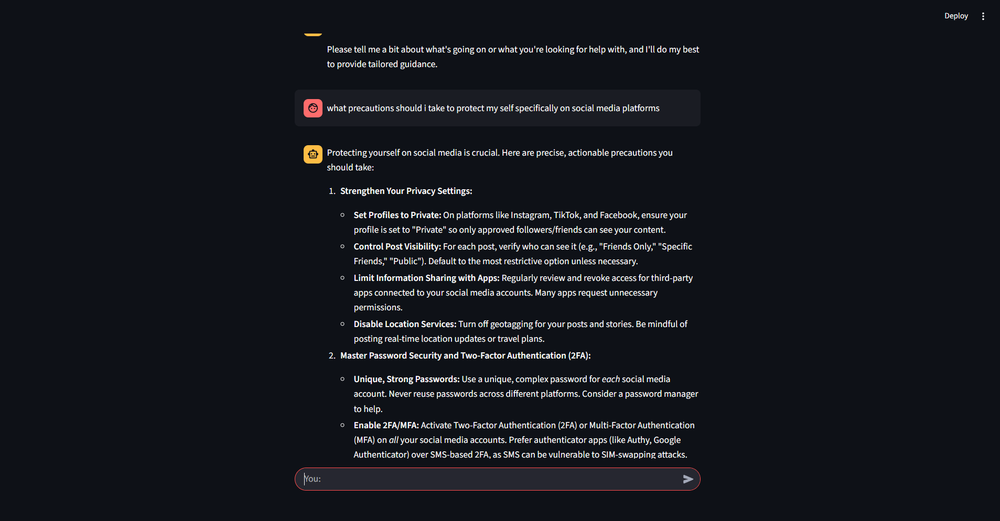

# Gen AI Mini Projects

<div align="center">


**A curated collection of practical generative AI projects demonstrating real-world applications, best practices, and innovative use cases.**

[About](#about) • [Projects](#projects) • [Getting Started](#getting-started) • [Usage](#usage) • [Contributing](#contributing) • [License](#license)

</div>

---

## 📋 Table of Contents

- [About](#about)
- [Projects](#projects)
  - [Cyber-Buddy: AI Cybersecurity Assistant](#cyber-buddy-ai-cybersecurity-assistant)
  - [Text Summarizer: Intelligent Content Condensation](#text-summarizer-intelligent-content-condensation)
- [Features](#features)
- [Getting Started](#getting-started)
  - [Prerequisites](#prerequisites)
  - [Installation](#installation)
  - [Environment Setup](#environment-setup)
- [Usage Instructions](#usage-instructions)
- [Project Structure](#project-structure)
- [Contributing](#contributing)
- [License & Credits](#license--credits)

---

## 🎯 About

**Gen AI Mini Projects** is a comprehensive repository showcasing practical applications of generative AI technologies. Each project demonstrates different aspects of modern AI development, from prompt engineering and LLM integration to interactive web interfaces and real-world problem solving.

This repository serves as:
- 📚 **Learning Resource**: Understand how to build AI-powered applications
- 🔧 **Reference Implementation**: Production-ready code patterns and best practices
- 🚀 **Starter Template**: Quick-start for your own AI projects
- 💡 **Community Hub**: Collaborate and contribute to AI innovation

---

## 🚀 Projects

### Cyber-Buddy: AI Cybersecurity Assistant

**Empower users to take control of their digital safety with intelligent, conversational cybersecurity guidance.**

| Aspect | Details |
|--------|---------|
| **Purpose** | Provides real-time cybersecurity assistance, threat analysis, and defensive strategy recommendations |
| **Tech Stack** | LangChain, Google Generative AI (Gemini), Streamlit, Python |
| **Key Features** | Conversational AI, Context-aware responses, Chat history management, Safety-focused guidance |

#### What It Does

Cyber-Buddy is an AI-powered mentor designed to help individuals understand and respond to cybersecurity challenges. Whether users face potential threats, need security advice, or want to improve their cyber hygiene, Cyber-Buddy provides:

- **Threat Assessment**: Analyzes user situations to identify security risks
- **Actionable Guidance**: Step-by-step mitigation and prevention strategies
- **Educational Support**: Teaches cybersecurity best practices tailored to user skill level
- **Professional Escalation**: Recommends contacting authorities for critical incidents
- **Conversational Interface**: Natural dialogue for better understanding and engagement

#### Real-World Applications

- 🛡️ **Incident Response**: Rapid guidance when users suspect they've been compromised
- 📖 **Security Awareness Training**: Interactive learning about common threats
- 🔐 **Preventive Measures**: Personalized recommendations for improving security posture
- 📱 **Consumer Protection**: Guidance for non-technical users facing cyber issues
- 🏢 **Enterprise Support**: Supplementary resource for security teams and help desks

#### Directory Structure

```
Cyber-Buddy/
├── app.py                    # Main Streamlit application
├── model.py                  # LLM configuration and initialization
├── requirements.txt          # Project dependencies
└── Prompt/
    ├── System_Message.py     # AI system prompt and personality
    ├── Prompt_Builder.py     # Prompt templating and engineering
    └── Prompt.json           # Prompt templates and configurations
```



---

### Text Summarizer: Intelligent Content Condensation

**Transform lengthy content into concise, meaningful summaries with customizable tone and format.**

| Aspect | Details |
|--------|---------|
| **Purpose** | Condense large texts into summaries with user-defined tone, length, and format preferences |
| **Tech Stack** | LangChain, HuggingFace Endpoints, Streamlit, Python |
| **Key Features** | Multi-tone support, Flexible output formats, Multilingual summaries, Customizable length |

#### What It Does

Text Summarizer leverages advanced language models to transform lengthy documents, articles, or content into concise summaries. Users can customize:

- **Tone**: Professional, Fun, Explanatory, Detailed, Creative, Technical, or Code-Oriented
- **Length**: Short (50-60 words), Medium (100-120 words), or Large (150+ words)
- **Format**: Paragraph, Numbered Steps, or Bullet Points
- **Language**: English, Hindi, or Gujarati

#### Real-World Applications

- 📰 **Content Curation**: Quickly understand article gists without reading full texts
- 📚 **Research Acceleration**: Summarize papers and documents for faster literature review
- 💼 **Business Intelligence**: Condense reports and meeting notes for stakeholders
- 🎓 **Learning Enhancement**: Break down complex topics into digestible summaries
- 🌍 **Multilingual Support**: Understand content in your preferred language
- 💻 **Code Documentation**: Generate concise summaries of code and technical content

#### Directory Structure

```
Text Summarizer/
├── Text_summarizer.py        # Main application
├── template.json             # Prompt templates for summarization
└── [Other configuration files]
```


---

## ✨ Features

### Across All Projects

- ✅ **LLM Integration**: Seamless integration with state-of-the-art language models
- ✅ **Prompt Engineering**: Advanced prompt design for better AI responses
- ✅ **Interactive UI**: User-friendly Streamlit interfaces for easy interaction
- ✅ **Session Management**: Persistent state and chat history management
- ✅ **Environment Configuration**: Secure API key management with `.env`
- ✅ **Modular Design**: Clean separation of concerns for maintainability
- ✅ **Production-Ready**: Error handling and best practices implemented

---

## 🛠️ Getting Started

### Prerequisites

Before you begin, ensure you have:

- **Python 3.8 or higher** installed on your system
- **pip** package manager
- **Git** for cloning the repository
- **API Keys** for the LLMs:
  - [Google Generative AI](https://ai.google.dev/) (Gemini) for Cyber-Buddy
  - [HuggingFace](https://huggingface.co/) API token for Text Summarizer

### Installation

1. **Clone the Repository**

```bash
git clone https://github.com/Dhanam-patel/Gen-AI-Mini-Project.git
cd "Gen AI Mini Projects"
```

2. **Create a Virtual Environment** (Recommended)

```bash
# Windows
python -m venv venv
venv\Scripts\activate

# macOS/Linux
python3 -m venv venv
source venv/bin/activate
```

3. **Install Dependencies**

```bash
# Install global dependencies
pip install -r requirements.txt

# For Cyber-Buddy
cd Cyber-Buddy
pip install -r requirements.txt
cd ..

# For Text Summarizer (if separate requirements exist)
cd "Text Summarizer"
pip install -r requirements.txt 2>/dev/null || echo "Using global requirements"
cd ..
```

### Environment Setup

1. **Create a `.env` File** in the root directory or in each project folder:

```env
# For Cyber-Buddy (Google Generative AI)
GOOGLE_API_KEY=your_google_api_key_here

# For Text Summarizer (HuggingFace)
API_KEY=your_huggingface_api_token_here
```

2. **Obtain API Keys**:
   - **Google Generative AI**: Visit [ai.google.dev](https://ai.google.dev/), create a project, and generate an API key
   - **HuggingFace**: Sign up at [huggingface.co](https://huggingface.co/), go to Settings > Access Tokens, and create a token

3. **Secure Your Credentials**:
   - Never commit `.env` files to version control
   - Use `.gitignore` to exclude sensitive files
   - Rotate keys periodically

---

## 💻 Usage Instructions

### Running Cyber-Buddy

```bash
cd Cyber-Buddy
streamlit run app.py
```

The application will open in your browser at `http://localhost:8501`

**How to Use:**
1. Enter your cybersecurity concern or question in the chat input
2. Cyber-Buddy analyzes your situation and provides guidance
3. Continue the conversation for follow-up questions or clarifications
4. The chat history is maintained throughout your session

**Tips for Better Results:**
- Provide context about your situation for more accurate advice
- Be specific about the type of threat or concern
- Ask follow-up questions to get detailed guidance

---

### Running Text Summarizer

```bash
cd "Text Summarizer"
streamlit run Text_summarizer.py
```

The application will open in your browser at `http://localhost:8501`

**How to Use:**
1. Paste the text you want to summarize in the text area
2. Select your preferred tone from the dropdown
3. Choose the desired summary length
4. Pick your preferred output format
5. Select the language for the summary
6. Click "Summarize" to generate the output

**Tips for Better Results:**
- Use clear, well-structured text for best results
- For code summaries, use the "Code-Oriented" tone
- Experiment with different tones to find your preference

---

## 📁 Project Structure

```
Gen AI Mini Projects/
│
├── README.md                 # This file
├── requirements.txt          # Global project dependencies
│
├── Cyber-Buddy/
│   ├── app.py               # Main Streamlit app
│   ├── model.py             # LLM configuration
│   ├── requirements.txt      # Project-specific dependencies
│   └── Prompt/
│       ├── System_Message.py
│       ├── Prompt_Builder.py
│       └── Prompt.json
│
└── Text Summarizer/
    ├── Text_summarizer.py   # Main application
    └── template.json        # Summarization templates
```

---

## 🤝 Contributing

We welcome contributions from the community! Whether you want to fix bugs, add features, or create new projects, here's how:

### Getting Started with Contributing

1. **Fork the Repository**
   ```bash
   Click the "Fork" button on GitHub
   ```

2. **Create a Feature Branch**
   ```bash
   git checkout -b feature/your-feature-name
   ```

3. **Make Your Changes**
   - Follow the existing code style and structure
   - Add comments for complex logic
   - Test your changes thoroughly

4. **Commit Your Work**
   ```bash
   git commit -m "Add: Brief description of your changes"
   ```

5. **Push to Your Fork**
   ```bash
   git push origin feature/your-feature-name
   ```

6. **Open a Pull Request**
   - Provide a clear description of what you've changed
   - Reference any related issues
   - Include screenshots for UI changes

### Guidelines

- **Code Quality**: Write clean, readable, and well-documented code
- **Testing**: Test your changes with different inputs and edge cases
- **Documentation**: Update README and comments for new features
- **Commits**: Use descriptive commit messages
- **License**: All contributions must comply with the project license

### Reporting Issues

Found a bug or have a suggestion? Please create an [Issue](https://github.com/Dhanam-patel/Gen-AI-Mini-Project/issues) with:

- Clear title describing the problem
- Detailed description of the issue
- Steps to reproduce (for bugs)
- Expected vs. actual behavior
- Your environment details (Python version, OS, etc.)

### Feature Requests

We'd love to hear your ideas! Submit a feature request with:

- Use case description
- Why it would be valuable
- Potential implementation approach

---

## 📝 License & Credits

### License

This project is licensed under the **MIT License** - see the [LICENSE](LICENSE) file for details.

**Permission is hereby granted** to:
- ✅ Use, modify, and distribute this software
- ✅ Include this software in private and commercial projects
- ✅ Create derivative works

**With the condition** that:
- ⚠️ The above copyright notice is included
- ⚠️ The license notice is included in any copies

### Credits & Acknowledgments

- **LangChain**: For powerful LLM orchestration framework
- **Google Generative AI**: For the Gemini language models
- **HuggingFace**: For open-source model access and APIs
- **Streamlit**: For the intuitive web application framework
- **Python Community**: For the amazing ecosystem of libraries

### Technologies Used

- [Python 3.8+](https://www.python.org/)
- [LangChain](https://python.langchain.com/)
- [Streamlit](https://streamlit.io/)
- [Google Generative AI](https://ai.google.dev/)
- [HuggingFace](https://huggingface.co/)
- [LangChain HuggingFace](https://python.langchain.com/docs/integrations/llms/huggingface)

---

## 🎓 Learning Resources

To deepen your understanding of the technologies used:

- [LangChain Documentation](https://python.langchain.com/)
- [Prompt Engineering Guide](https://www.promptengineering.org/)
- [Streamlit Tutorial](https://docs.streamlit.io/)
- [Generative AI Best Practices](https://ai.google.dev/docs)

---

<div align="center">

### ⭐ If you find this repository helpful, please consider giving it a star!

**Made with ❤️ by the Gen AI Community**

[Back to Top](#gen-ai-mini-projects)

</div>